# Architecture Documentation

## System Overview

---

## Data Flow Diagram

---

## Component Diagram

---

## Signal Processing Pipeline

---

## Fraud Scoring Flow

```mermaid
flowchart TB
    START([Session Signals]) --> FEAT[Feature Extraction]
    
    FEAT --> RULE_CHECK{Rule Engine}
    RULE_CHECK -->|Triggers| RULE_SCORE[Rule Scores]
    
    FEAT --> ML_CHECK{ML Model}
    ML_CHECK -->|Inference| ML_SCORE[ML Score]
    
    RULE_SCORE --> ENSEMBLE[Ensemble Combiner]
    ML_SCORE --> ENSEMBLE
    
    ENSEMBLE --> THRESHOLD{Score Threshold}
    
    THRESHOLD -->|< 0.3| ALLOW[✅ ALLOW]
    THRESHOLD -->|0.3 - 0.7| REVIEW[⚠️ REVIEW]
    THRESHOLD -->|> 0.7| BLOCK[🚫 BLOCK]
    
    ALLOW --> OUTPUT([FraudResult])
    REVIEW --> OUTPUT
    BLOCK --> OUTPUT
```

---

## Deployment Architecture

---

## Entity Relationship Diagram

---

## Phase Development Flow

---

## SDK Event Lifecycle

